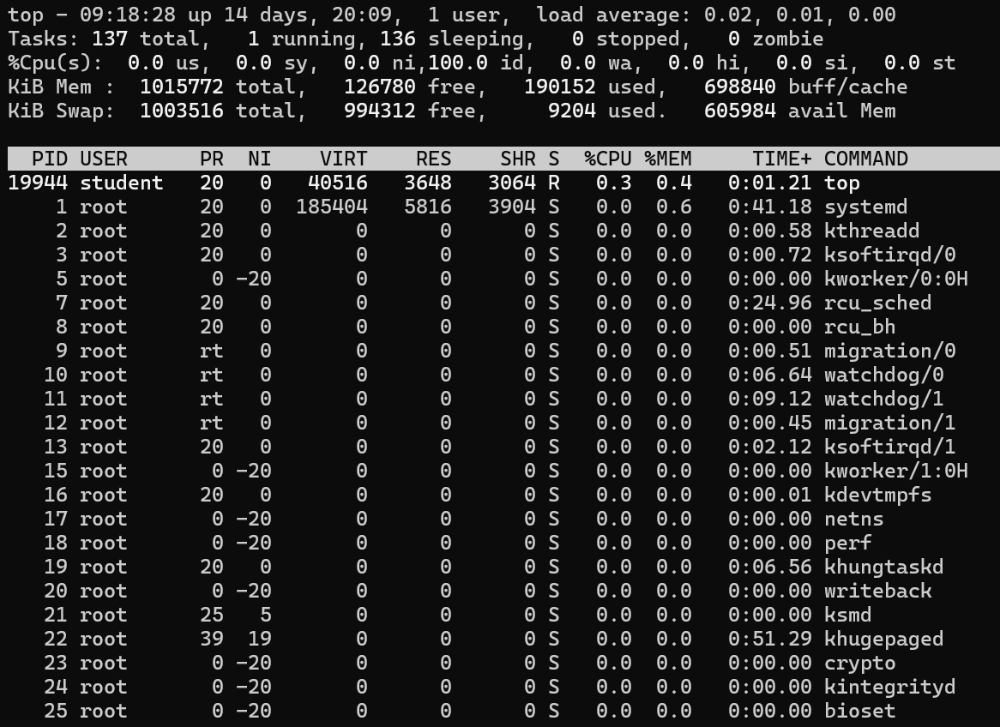
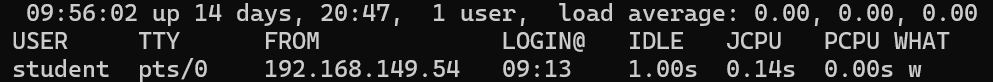

# Linux monitor

Now we will have to use tools or programs to monitor and gather information about the status of the linux operating system!

The most important and first thing is to check who is connected to the server, to know how many users are online, to know where they connected to the server, to check the log files in the folder:
```
cd /var/log/
```
then let's check which processes or programs are taking up memory and if a program is running that is not necessary, remove it to free up resources.

### TOP

With **top** we can see in real time summary information about the operating system.

In the terminal we can enter the following command to start

````
top
````

or
```
ps aux | less
```

### W

The **w** command displays information about users currently on the machine and their processes.

````
w
````

It will show details such as login names, terminal (TTY), remote host or IP address, login time, idle time, and current process.



### who

The **who** command displays information about users who are currently logged in.
```
who
````

````
users
````

When we find a user who is **suspicious** , we can terminate him.

````
sudo killall -u username
````
or
````
sudo killall -9 -u username
````


## DISK PARTITIONS

To manage and view disk partitions in Linux, you can use several commands. Here are some of the most commonly used ones:

### fdisk

**fdisk**: A command-line utility to view and manage disk partitions. Use 
````
sudo fdisk -l 
````
to list all partitions on all disks.

### lsblk

lsblk: Lists all block devices and their partitions along with sizes.  
```
lsblk
````

### df
 
df: Displays the amount of disk space used and available on filesystems.

````
df -h
````

### parted

A tool to create, resize, move, and copy partitions. Invoke it with sudo parted followed by disk operations commands.


